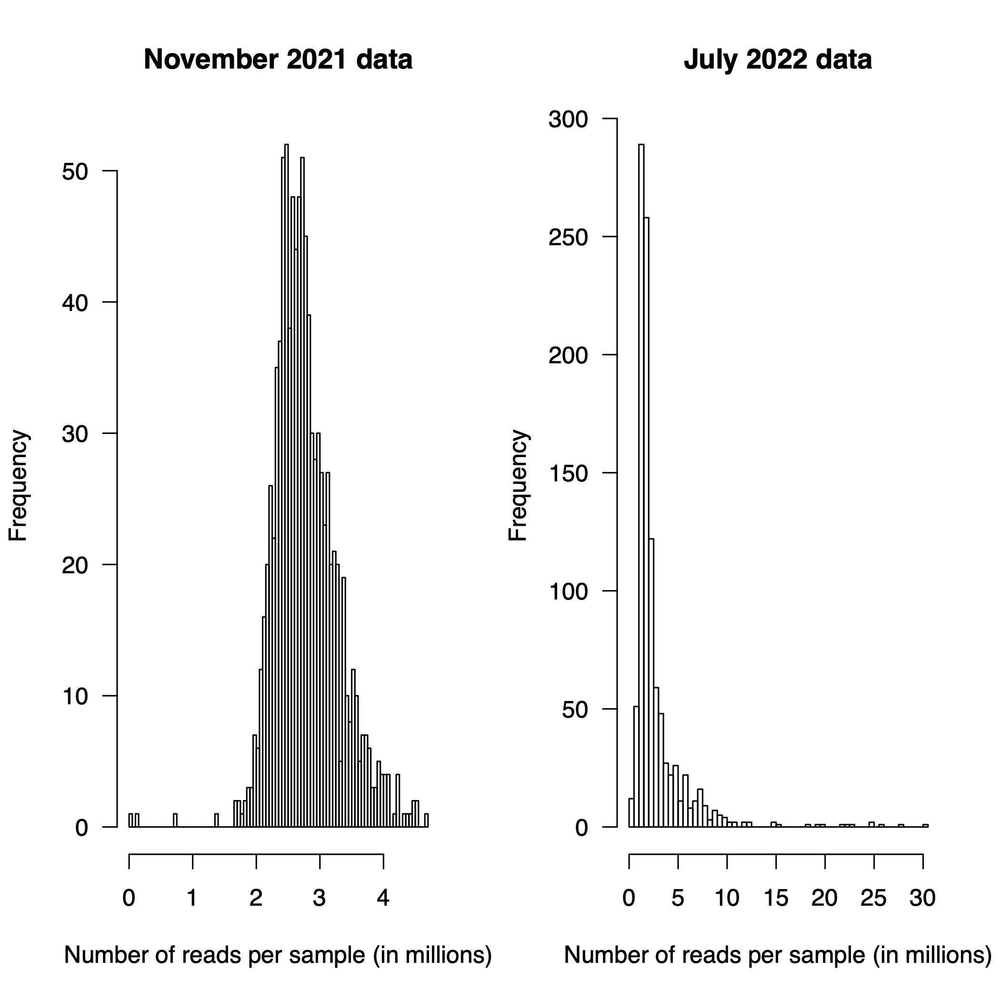
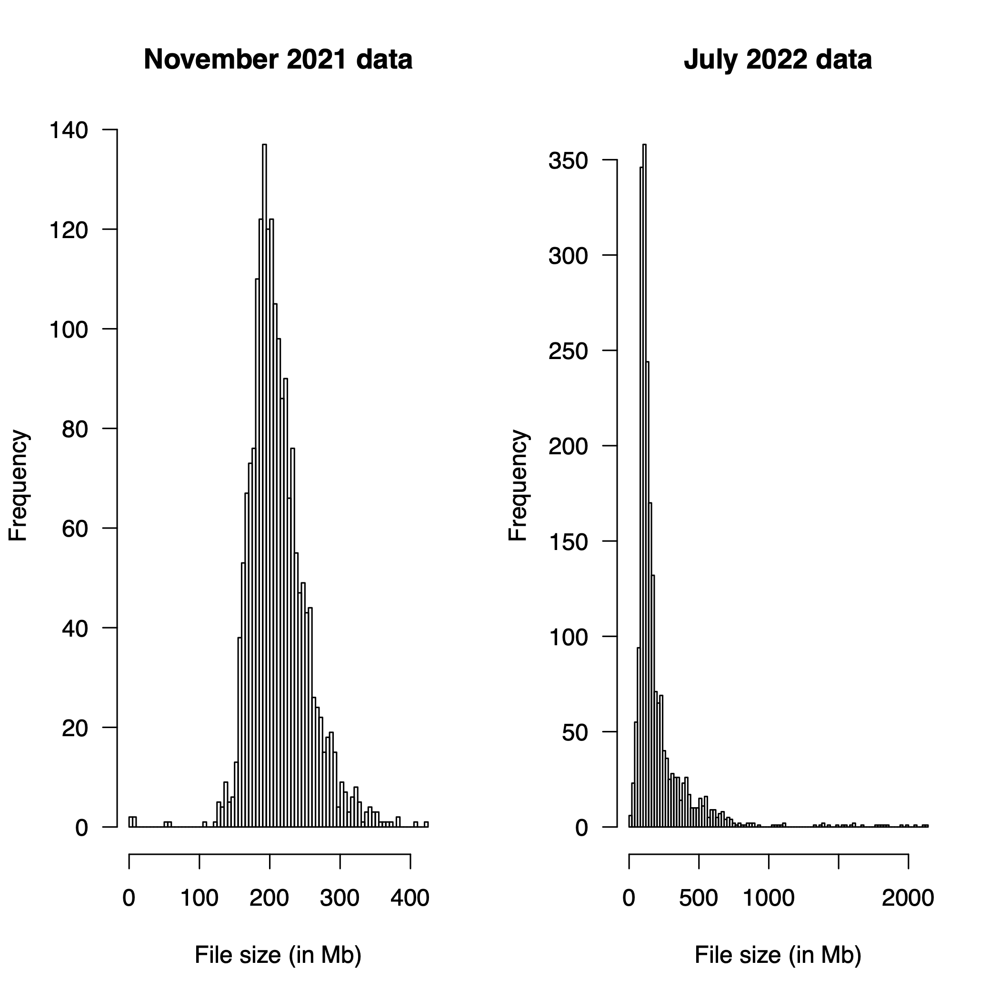

# Assorted tips and tricks


## Directory
1. [Making scripts reusable](#Making-scripts-reusable)
2. [Converting named R colors to RGB values](#Converting-named-R-colors-to-RGB-values)
3. [Counting the number of SNPs in a VCF file](#Counting-SNPs-in-a-VCF-file)
4. [Search and replace in `vim`](#Search-and-replace-in-vim)
5. [Count reads in a FASTQ file](#Count-reads-in-a-FASTQ-file)
6. [Modify GFF3 file](#Modify-GFF3-file)

## Making scripts reusable
You may often find yourself needing to re-create figured from an analysis with parameters slightly altered or using a different dataset (or a subset of the original). When you first conduct an analysis, you might hard-code input and output files in your script. This is fine, but can become cumbersome if you need to constantly change names in the file. The good news is that you can write the code once and re-use it as many timeas as you like without editing the script!

**In R:**<br>
The following line should appear somewhere near the top of your R script (right after you import the required packages for example).
```R
args = commandArgs(trailingOnly = TRUE)
```
Then, wherever you would normally have a filename in your script, you can replace them with `args[1]`, `args[2]`, and so on. I prefer to use them sequentially in the script. Then, in your shell (.sh) script, you would simply have one line that calls the R script that you want to use and the filenames you would like to be inserted into R script:
```bash
Rscript scriptname.R filename1 filename2
```

**In Python:**<br>
You will need the following lines at the top of your python script (along with other modules you will be importing)
```python
import os
import sys
```
The placeholder for the filename is similar to R, but slightly different: `sys.argv[1]`, `sys.argv[2]`, etc. You would feed the filenames into the python exactly the same way that you would feed them into R because both are done using shell scripting.
```bash
python scriptname.py filename1 filename2
```


## Converting named R colors to RGB values
If you want to figure out the RGB (red, green, blue) value of a named R color such as those found [here](http://www.stat.columbia.edu/~tzheng/files/Rcolor.pdf) or through the `colors()` R function (works in RStudio), you can use the `col2rgb()` function. For example, I used this function so that I could perfectly re-create the colors from the PCA plot in the genetic diversity project to make the map of Northern Wild Rice (NWR) collection sites map in Python.<br>
**Input:**
```R
col2rgb("red3")
```
**Output:**
```R
      [,1]
red    205
green    0
blue     0
```
You'll want to use this because the color "red3" is specific to R, but an RGB value of (205,0,0) will work in any computing language.

**Complete results:**<br>
| Lake or River | R color | RGB color | HEX color | Result |
| ------------- | ------- | --------- | --------- | ------ |
| _Z. aquatica_ | red3 | (205,0,0) | #cd0000|  |
| Bass Lake | red | (255,0,0) | #ff0000 |  |
| Clearwater River | orange | (255,165,0) | #ffa600 |  |
| Dahler Lake | yellow3 | (205,205,0) | #cdcd00 |  |
| Decker Lake | yellow | (255,255,0)| #ffff00 |  |
| Garfield Lake | green3 | (0,205,0) | #00cd00 |  |
| Mud Hen Lake | green | (0,255,0) | #00ff00 |  |
| Necktie River | blue4 | (0,0,139) | #00008b |  |
| Ottertail River | blue | (0,0,255) | #0000ff |  |
| Phantom Lake | violetred3 | (205,50,120) | #cd3278 |  |
| Lake Plantagenet | violet | (238,130,238) | #ee82ee |  |
| Shell Lake | purple4 | (85,26,139) | #541a8b |  |
| Upper Rice Lake | purple | (160,32,240) | #a020f0 |  |

Something to pay attention to: You may not be able to simply enter the RGB values into a function and expect it to work. For example, the `rgb()` function in R requries the RGB values to be given as fractions rather than a series of 3 numbers. Instead, you need to give the RGB values as fractions of values. Since the maximum value for the amount of red, green, and blue in any given color is 255, you must simply use the values you found above and add 255 as the denominator.

```R
rgb(205/255, 0/255, 0/255)
```

**How did I get the colored boxes to appear in the table above?**
I used the following code! (Only the first color, red3, is shown. To get a different color, you'd need to replace the HEX color code in both places where it occurs in the code below.)
```md

```

## Counting SNPs in a VCF file
Simply replace `input.vcf` with the name of your VCF file. This method works by counting the number of lines in a VCF file excluding the header lines.
```bash
grep -v "^#" input.vcf | wc -l
```

## Search and replace in `vim`
If you want to do a quick search and replace in the `vim` editor, you can quickly accomplish your goals with a few quick keystrokes.

The pattern is something like this:
```bash
%s/text-you-want-to-replace/text-you-want-to-replace-it-with/g
```

For example, if I have a text file that looks like this:
```bash
Sample_0001/Sample_0001_sorted.bam
Sample_0002/Sample_0002_sorted.bam
Sample_0003/Sample_0003_sorted.bam
Sample_0004/Sample_0004_sorted.bam
Sample_0005/Sample_0005_sorted.bam
...
```
and I want to strip everything from the forward slash to the end of the line, I can rapidly accomplish that with one line of code:
```bash
%s/\/.*$//g
```
Notice how I used _regular expressions_ here. I will break this down character by character.
1. The backslash (`\`) in the fourth position indicates that the forward slash following it should be interpreted literally.
2. The period (`.`) is a wildcard that matches any character.
3. The asterisk (`*`) indicates that the _preceding element_ should be matched zero or more times.
4. The dollar symbol (`$`) indicates the end of the line

Putting all of this together, any strings (patterns) that start with a forward slash (`/`) will be removed from the occurrence of the forward slash to the end of the line. This is also because we left the "text-you-want-to-replace-it-with" blank. You are replacing the defined string with a blank/empty string. Pretty simple/cool, right?

If you are successful, your file should now look like this:
```bash
Sample_0001
Sample_0002
Sample_0003
Sample_0004
Sample_0005
...
```

## Count reads in a FASTQ file
**Background note:** The working directory for this analysis was `/scratch.global/haasx092/reneth_gwas`.
The first step in this analysis is to create text files with lists of all FASTQ (sequence) files. You can accomplish that using the following code:

First, for November 2021 data:
```bash
ls /home/jkimball/data_delivery/umgc/2021-q4/211108_A00223_0697_BHNY3NDSX2/Kimball_Project_008/*fastq.gz > nov21_fastq_list.txt
```
Second, for July 2022 data:
```bash
# july 2022 data
ls /home/jkimball/data_delivery/umgc/2022-q3/220701_A00223_0866_AHVFKKDSX3/Kimball_Project_009/*fastq.gz > july22_fastq_list.txt
```
The way you get the read counts is by: 1) opening each FASTQ file one at a time, 2) counting the number of lines in each file, 3) dividing the total number of lines in each file by 4 (because each sequencing read consists of exactly 4 lines), and 4) writing the output to its own text file. An example of this code (for November 2021 data) is given below:
```bash
for i in $(cat nov21_fastq_list.txt);
do
echo $(zcat ${i} | wc -l)/4|bc > nov21_fastq_read_count.txt
done
```

Two nearly-identical scripts were used to count the number of reads in each `FASTQ` file.

The number of reads in the November 2021 data release were counted using the script [count_reads_per_fastq_file_nov21.sh](count_reads_in_fastq_file/count_reads_per_fastq_file_nov21.sh) and the number of reads in the July 2022 data release were counted using the script [count_reads_per_fastq_file_july22.sh](count_reads_in_fastq_file/count_reads_per_fastq_file_july22.sh). The input file for these scripts are [nov21_fastq_list.txt](count_reads_in_fastq_file/nov21_fastq_list.txt) and [july22_fastq_list.txt](count_reads_in_fastq_file/july22_fastq_list.txt), respectively. The files are based on the principle that each read in a `FASTQ` file is represented by 4 lines. Therefore, you can count the number of reads in a file by counting the total number of lines in that file and dividing by 4. The output files of these scripts will be [nov21_fastq_read_count.txt](count_reads_in_fastq_file/nov21_fastq_read_count.txt) and [july22_fastq_read_count.txt](count_reads_in_fastq_file/july22_fastq_read_count.txt).

We used paired-end sequencing for our GBS analysis so each sample is actually represented by two files (forward reads; R1 and reverse reads R2). You can see that in the files [nov21_fastq_read_count.txt](count_reads_in_fastq_file/nov21_fastq_read_count.txt) and [july22_fastq_read_count.txt](count_reads_in_fastq_file/july22_fastq_read_count.txt). While it's useful (and a good idea to do some checking to make sure the numbers are identical for both files, we don't want to keep both files to make plots showing the distribution of reads/sample. For this reason, I used the following `awk` code to remove every other line from the files that resulted from the previous scripts:

```bash
awk 'FNR%2'  nov21_fastq_read_count.txt > nov21_fastq_read_count_every_other.txt
```
and
```bash
awk 'FNR%2' july22_fastq_read_count.txt > july22_fastq_read_count_every_other.txt
```

In order to visualize the data, I wrote a short R script: [plot_FASTQ_read_count_data.R](count_reads_in_fastq_file/plot_FASTQ_read_count_data.R). This was run on my personal machine, not MSI (which is only really relevant because you tell from the `setwd()` function).<br>
```R
setwd("~/Documents/wild_rice/plot_read_depth_reneth_gbs_data")
```

**Note:** Please make sure you start the script with `library(data.table)` because the script requires the [`data.table`](https://cran.r-project.org/web/packages/data.table/vignettes/datatable-intro.html) package to be functional.

The first thing the script will do is read in the data:<br>
```R
# Read in file size data
nov21_data <- fread("november_2021_fastq_file_sizes.txt")
july22_data <- fread("july_2022_fastq_file_sizes.txt")

# Read in read count data
nov21_read_count <- fread("nov21_fastq_read_count_every_other.txt")
july22_read_count <- fread("july22_fastq_read_count_every_other.txt")
```

Then it will assign appropriate names to each data.table's columns:<br>
```R
# Set names for file size data.table
setnames(nov21_data, c("sample_name", "size_bytes"))
setnames(july22_data, c("sample_name", "size_bytes"))

# Set names for readcount data.table
setnames(nov21_read_count, "num_reads")
setnames(july22_read_count, "num_reads")
```
Add a new column to the file size data.table so we can plot the file size in megabytes rather than bytes:<br>
```R
# Add a new column to file size data.table (currently it's in bytes but we want megabytes)
nov21_data[, size_mb := size_bytes/1e6]
july22_data[, size_mb := size_bytes/1e6]
```
Reorder file size data.table based on megabytes column:<br>
```R
# Order file size data.table by file size (in mb) so we can see the distribution in an orderly fashion
nov21_data[order(size_mb)]
july22_data[order(size_mb)]
```
Next, we will remove a stray column:<br>
```R
# Remove odd/non-existent sample name that only exists because "Analysis" was a sub-directory in the directory where we pulled the file size data from
nov21_data <- nov21_data[sample_name != "Analysis"]
july22_data <- july22_data[sample_name != "Analysis"]
```

This is the part of the script that accomplishes the plotting:<br>
```R
# Plot distribution of read counts
pdf("Reneth_GBS_data_read_counts.pdf")
layout(matrix(c(1:2), ncol = 2))
nov21_read_count[, hist(num_reads/1e6, breaks = 100, xlab = "Number of reads per sample (in millions)", main = "November 2021 data", las = 1)]
july22_read_count[, hist(num_reads/1e6, breaks = 100, xlab = "Number of reads per sample (in millions)", main = "July 2022 data", las = 1)]
dev.off()
```

The figure will look like this:<br>


Some helper files that might be handy for this analysis:<br>
[nov21_fastq_list.txt](count_reads_in_fastq_file/nov21_fastq_list.txt)<br>
[july22_fastq_list.txt](count_reads_in_fastq_file/july22_fastq_list.txt)<br>
[nov21_fastq_read_count_every_other.txt](count_reads_in_fastq_file/nov21_fastq_read_count_every_other.txt)<br>
[july22_fastq_read_count_every_other.txt](count_reads_in_fastq_file/july22_fastq_read_count_every_other.txt)<br>

You can also create a figure that shows the distribution of file sizes.<br>
```R
# Plot distrbution of file sizes
pdf("Reneth_GBS_data_fastq_file_sizes.pdf")
layout(matrix(c(1:2), ncol = 2))
nov21_data[, hist(size_mb, breaks = 100, xlab = "File size (in Mb)", main = "November 2021 data", las = 1)]
july22_data[, hist(size_mb, breaks = 100, xlab = "File size (in Mb)", main = "July 2022 data", las = 1)]
dev.off()
```

That figure will look like this:<br>


## Modify GFF3 file
I used the script [update_gff3_chromosome_names.sh](update_gff3_chromosome_names.sh) to update the chromosome names in the GFF3 file.
